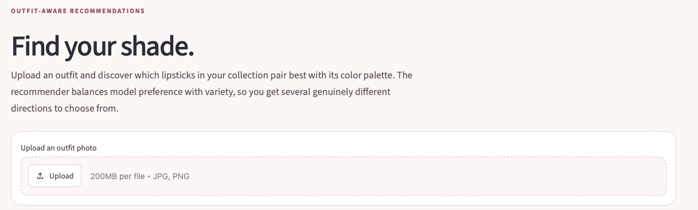
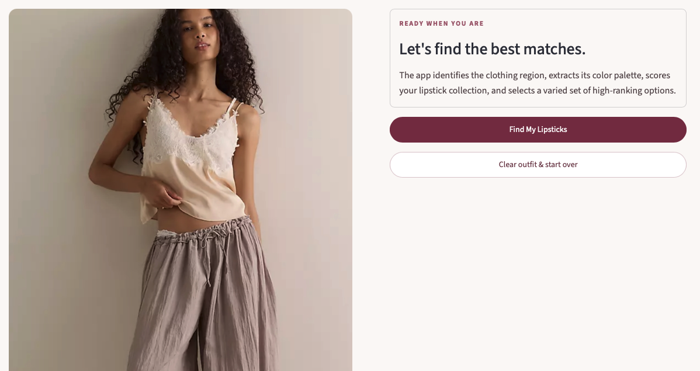
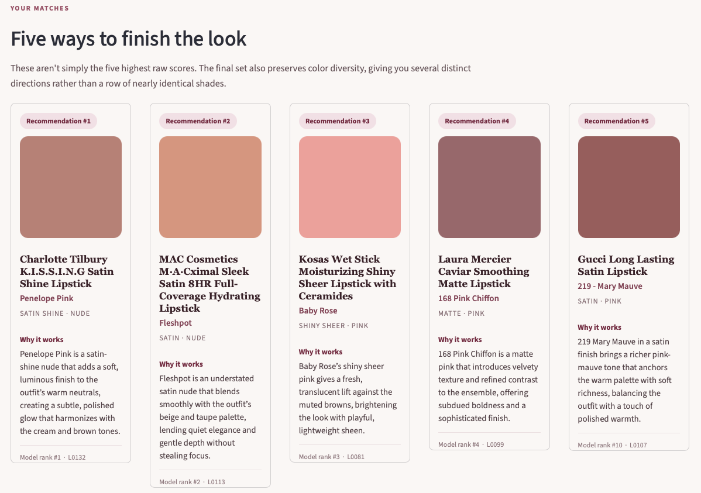

# Persistent Multimodal Lipstick Recommendation System

A multimodal recommendation system that matches lipsticks from a persistent personal collection to an uploaded outfit photo.

The system combines **computer vision, color-space feature engineering, multimodal weak supervision, pairwise preference modeling, utility learning, diversity-aware recommendation, persistent storage, and an LLM explanation layer**.

---

## Overview

This project began with a simple product problem:

> How can an AI assistant recommend lipstick shades from a user's actual collection without relying on conversational memory?

Instead of asking a language model to "remember" products, the system treats a structured lipstick catalog as the **persistent source of truth**.

The production pipeline is:

    Uploaded Outfit
          ↓
    Clothing Segmentation
          ↓
    CIELAB Palette Extraction
          ↓
    Outfit–Lipstick Feature Engineering
          ↓
    Frozen Utility Ranker
          ↓
    Diversity-Aware Top-K Selection
          ↓
    Recommended Lipsticks
          ↓
    LLM Explanation Layer

The application also stores recommendation history, selected lipsticks, and user feedback in SQLite.

---

## Demo

The Streamlit application allows a user to:

- Upload an outfit photo
- Receive five lipstick recommendations from a persistent catalog
- View product names, shades, finishes, and color families
- Read short AI-generated explanations for each recommendation
- Save the lipstick they selected
- Record whether they liked the recommendation
- Browse their lipstick collection
- Review recommendation history

**Live demo:** *Coming soon*

### App Preview

---

## Why This Project Is Interesting

This project is not simply an image classifier or a standard recommender.

It combines several different ML and product problems:

- **Computer vision** for isolating clothing from an outfit image
- **Color science** using CIELAB rather than raw RGB
- **Multimodal reasoning** using a vision-language model as a weak preference teacher
- **Pairwise preference learning** rather than direct multiclass prediction
- **Bradley–Terry modeling** for converting pairwise judgments into latent utilities
- **Supervised ranking** using a lightweight Ridge model
- **Diversity-aware retrieval** to avoid returning near-duplicate shades
- **Persistent data architecture** using SQLite
- **Generative explanations** downstream of the deterministic ranker

The final system separates model responsibilities cleanly:

> **The ranking model decides which lipsticks to recommend. The LLM only explains recommendations that have already been selected.**

This keeps the expensive generative component out of the actual ranking decision while still providing a natural user experience.

---

## Data

The prototype catalog contains **138 real commercial lipsticks** across red, pink, and nude color families.

The structured catalog includes:

- Brand
- Product name
- Shade name
- Finish
- Color family
- Product image / swatch
- Extracted CIELAB color values
- Chroma
- Persistent lipstick ID

Each lipstick is assigned an ID such as:

    L0001
    L0002
    ...
    L0138

The application queries this structured collection rather than relying on language-model memory.

---

## Lipstick Color Extraction

Lipstick color was extracted from product images using **K-Means clustering in CIELAB color space**.

For each image:

1. The image is converted from RGB to CIELAB.
2. K-Means with `K = 5` identifies major color clusters.
3. Cluster chroma is calculated as:

       C* = sqrt(a*² + b*²)

4. The highest-chroma cluster is used as the initial lipstick-color candidate.
5. Ambiguous images are flagged for manual review.

On a manually validated subset:

| Metric | Result |
|---|---:|
| Highest-chroma cluster accuracy | **88.5%** |
| Top-2 chroma recall | **100%** |

A relative chroma-gap heuristic was used to identify uncertain cases for manual review.

This created a standardized numerical color representation for every lipstick in the catalog.

---

## Outfit Processing

The outfit-processing pipeline uses a **SegFormer clothing-segmentation model** to isolate relevant garment regions from an uploaded photograph.

The clothing mask includes categories such as:

- Upper clothes
- Dresses
- Pants
- Skirts
- Coats
- Jumpsuits

The segmented clothing region is then represented using a five-color palette.

For each outfit, the system computes characteristics including:

- Representative CIELAB color
- Dominant palette color
- Weighted palette lightness
- Weighted palette chroma
- Lightness range
- Chroma range
- Dominant-color proportion
- Palette entropy
- Palette diversity

Palette diversity is calculated using weighted pairwise distances between palette colors.

---

## Outfit–Lipstick Feature Engineering

Each lipstick is represented **relative to the uploaded outfit**, rather than only by its absolute color.

The production ranker uses **23 features**, including:

- Representative lightness contrast
- Representative chroma contrast
- Representative hue distance
- Representative perceptual distance
- Dominant-color lightness contrast
- Dominant-color chroma contrast
- Dominant-color hue distance
- Dominant-color perceptual distance
- Minimum palette ΔE
- Closest-palette lightness contrast
- Closest-palette chroma contrast
- Closest-palette hue distance
- Closest-palette proportion
- Maximum palette ΔE
- Weighted mean palette ΔE
- Weighted standard deviation of palette ΔE
- Weighted lightness contrast
- Weighted chroma contrast
- Weighted hue distance
- Lipstick L*
- Lipstick a*
- Lipstick b*
- Lipstick chroma

This representation allows the model to learn preferences about the **relationship between a lipstick and an outfit**, rather than learning a globally preferred lipstick color.

---

## Multimodal Weak Supervision

One of the central challenges was defining what makes one lipstick more visually compatible with an outfit than another.

Manually collecting thousands of human pairwise fashion judgments was outside the scope of the project, so I used a multimodal vision-language model as a **weak preference teacher**.

The teacher model was:

**Qwen2.5-VL-7B-Instruct**

For each outfit, the teacher compared lipstick pairs while viewing:

- The outfit image
- Standardized lipstick swatches
- A fixed compatibility prompt

The teacher evaluated pairwise compatibility based on concepts such as:

- Color harmony
- Contrast
- Formality
- Mood
- Overall visual coherence

### Order-Invariance Filtering

Vision-language models can exhibit positional bias.

To reduce this problem, every candidate pair was evaluated twice:

    A vs B
    B vs A

A preference was retained only when the **same lipstick won in both presentation orders**.

If reversing presentation order changed the winner, the comparison was treated as unstable and discarded.

This produced a higher-confidence weak-label dataset while explicitly allowing the teacher to abstain when its judgment was order-sensitive.

---

## Bradley–Terry Utility Modeling

Stable pairwise preferences were converted into latent per-outfit lipstick utilities using a **Bradley–Terry model**:

    P(i > j) = sigmoid(u_i - u_j)

where `u_i` and `u_j` represent the latent utilities of two candidate lipsticks within the same outfit context.

The resulting utilities provide a scalar representation of the teacher's pairwise preference structure.

Bradley–Terry reconstruction of the stable teacher graph reached approximately **99%**, indicating that the retained pairwise judgments were highly compatible with an underlying scalar ranking.

Normalized Bradley–Terry utilities were then used as supervised targets for the production ranker.

---

## Ranking Model

The final production model is intentionally lightweight:

    StandardScaler
          ↓
    Ridge Regression
          ↓
    Predicted Compatibility Utility

The model predicts a latent compatibility utility for every lipstick given an outfit context.

This architecture was selected after evaluating several alternatives, including:

- Pairwise logistic regression
- Histogram Gradient Boosting
- Explicit context-interaction features
- Semantic interaction features
- CLIP-based distillation
- Probability-margin aggregation
- Alternative nonlinear ranking approaches

Several more complex approaches did **not** outperform the simpler utility-learning approach.

Rather than adding complexity without evidence of improvement, those experiments were retained as negative results and excluded from the production system.

---

## An Important Finding: Context Scale Mattered More Than Model Complexity

One of the most useful findings from the project was that the primary bottleneck was not model complexity.

It was the number of **independent outfit contexts** available during development.

The development set was expanded from **22 to 71 independent outfit contexts**.

On the 49 newly added development outfits, increasing training context coverage from the original development set to the expanded development set produced a substantial improvement in held-out teacher concordance.

This provided strong evidence that the system benefited more from **broader contextual coverage** than from increasingly complicated model architectures.

That finding motivated the decision to retain the lightweight Ridge utility ranker for the final system.

---

## Final Prospective Evaluation

The final evaluation was designed to avoid tuning on the test set.

Before generating weak labels for the final outfits, the expanded dataset was divided into development and final-holdout contexts.

### Development Data

- **71 independent outfit contexts**
- **833 identifiable Bradley–Terry utility targets**

### Final Holdout

- **10 untouched outfit contexts**

The final scaler and Ridge ranker were trained using the complete development set.

Predictions for all final-holdout candidates were then **saved before the teacher labels for those outfits were generated**.

Only after predictions were frozen was Qwen2.5-VL-7B used to generate the final pairwise evaluation labels.

### Results

| Metric | Result |
|---|---:|
| Mean outfit concordance | **80.1%** |
| Median outfit concordance | **80.6%** |
| Pooled edge concordance | **80.6%** |
| Stable teacher comparisons | **160** |
| Prospectively held-out outfits | **10** |

> **On 10 prospectively held-out outfit contexts, the frozen ranker achieved 80.6% concordance with 160 order-invariant multimodal teacher preferences, after increasing development coverage from 22 to 71 independent outfit contexts.**

These values measure concordance with a multimodal weak preference teacher — **not human recommendation accuracy**.

---

## Research-Time vs. Production-Time Architecture

A major design decision was separating expensive research-time supervision from lightweight production inference.

### Offline Training

    Outfit Images
         +
    Candidate Lipstick Swatches
              ↓
       Qwen2.5-VL-7B
      Pairwise Judgments
              ↓
       Order-Invariance
          Filtering
              ↓
       Stable Pairwise
         Preferences
              ↓
       Bradley–Terry
          Utilities
              ↓
       Ridge Ranker

### Interactive Production

    Uploaded Outfit
          ↓
    Clothing Segmentation
          ↓
    CIELAB Palette Extraction
          ↓
    23 Outfit–Lipstick Features
          ↓
    Frozen StandardScaler
          ↓
    Frozen Ridge Utility Model
          ↓
    Diversity-Aware Selection
          ↓
    Five Recommendations

The expensive multimodal teacher is therefore **not required during interactive ranking**.

This makes production inference substantially lighter than repeatedly asking a large vision-language model to compare lipstick pairs.

---

## Diversity-Aware Recommendation

Simply returning the five highest predicted utilities can produce visually redundant recommendations.

For example, several nearly identical red shades might occupy the top positions.

The application therefore combines predicted utility with **diversity-aware selection**.

Candidate lipsticks are represented using color and outfit-relative features and selected to preserve meaningful variation across the final recommendation set.

As a result, the user receives several distinct stylistic directions rather than five near-duplicate shades.

---

## LLM Explanation Layer

After the ranking pipeline selects the final recommendations, an OpenAI language model generates short natural-language descriptions of how each lipstick relates visually to the outfit.

Importantly, the LLM:

- **Does not select lipsticks**
- **Does not rerank recommendations**
- **Does not modify predicted utilities**
- Receives only the already-selected recommendations and relevant color context

Conceptually:

    Frozen Ranker
         ↓
    Top-5 Lipsticks
         ↓
    LLM Explanation Layer
         ↓
    User-Friendly "Why It Works" Text

This preserves the separation between the learned recommendation system and the generative user-interface layer.

---

## Persistent User Data

The application uses **SQLite** to maintain persistent state.

### Lipstick Collection

Each lipstick record can store:

- Brand
- Product
- Shade
- Finish
- Color family
- CIELAB coordinates
- Chroma
- Image path
- Active / inactive status

### Recommendation Sessions

Each recommendation session stores:

- Timestamp
- Recommended lipsticks
- Recommendation order
- Model rank
- Predicted utility
- Selected lipstick
- User feedback

Feedback is represented separately from selection:

    1  = liked
    0  = neutral
    -1 = disliked

This architecture provides a foundation for future personalization based on actual user behavior.

---

## Application Features

The Streamlit application contains three primary views.

### Find a Match

Upload an outfit photograph and generate five lipstick recommendations.

For each recommendation, the app displays:

- Product and shade name
- Lipstick swatch
- Finish
- Color family
- Model rank
- AI-generated explanation

The uploaded outfit and current recommendations remain available while navigating between pages during the session.

### My Collection

Browse the persistent lipstick collection, including:

- Brand
- Product
- Shade
- Finish
- Color family

### History

Review previous recommendation sessions and see:

- Recommended lipsticks
- Which lipstick was selected
- Model rank
- User feedback

---

## Repository Structure

    lipstick_app/
    │
    ├── app.py
    │
    ├── src/
    │   ├── __init__.py
    │   ├── color_utils.py
    │   ├── outfit_processing.py
    │   ├── ranking_pipeline.py
    │   └── database.py
    │
    ├── model_artifacts/
    │   ├── v8_scaler.joblib
    │   ├── v8_ridge_model.joblib
    │   └── v8_feature_spec.csv
    │
    ├── lipsticks/
    │   └── ranking_swatches/
    │
    ├── data/
    │   └── lipstick_recommender.db
    │
    ├── lipstick_catalog_with_colors.csv
    ├── requirements.txt
    └── README.md

---

## Running Locally

### 1. Clone the repository

    git clone YOUR_REPOSITORY_URL
    cd lipstick_app

### 2. Create an environment

Python 3.11 is recommended.

Install the required dependencies:

    pip install -r requirements.txt

### 3. Configure the Optional LLM Explanation Layer

Create a `.env` file in the project root:

    OPENAI_API_KEY=your_key_here

The OpenAI API is used only for natural-language explanations.

**The underlying recommendation and ranking pipeline does not depend on the OpenAI API.**

Never commit your `.env` file or API key to GitHub.

Your `.gitignore` should contain:

    .env

### 4. Launch the Application

    streamlit run app.py

---

## Experimental Design Principles

Several methodological decisions were particularly important during development:

1. **Evaluation splits are made by outfit context**, not randomly across mirrored pairwise examples.

2. **Bidirectional VLM judgments** are used to identify position-sensitive comparisons.

3. **Unstable teacher comparisons are treated as abstentions** rather than forced labels.

4. **Bradley–Terry utilities are training targets**, while stable pairwise teacher preferences remain the primary evaluation signal.

5. **The final holdout was not used for model selection.**

6. **Final holdout predictions were frozen before final teacher labels were generated.**

7. **Weak multimodal preferences are not presented as human ground truth.**

8. **Negative experiments are treated as useful findings rather than hidden.**

These choices were intended to make the experimental conclusions more defensible despite the project's relatively small dataset.

---

## Limitations

### Weak Labels Are Not Human Preferences

The system is trained and evaluated against multimodal VLM judgments rather than human stylist annotations.

The reported **80.6% concordance** therefore measures agreement with the weak preference teacher, not real-world human recommendation accuracy.

### Limited Outfit Coverage

Expanding independent outfit coverage substantially improved performance, but the development dataset remains small relative to a production recommendation system.

### Color-Focused Representation

The production model primarily captures visual color compatibility.

It does not currently model factors such as:

- Skin tone
- Face features
- Hair color
- Personal style
- Occasion
- Individual lipstick preferences
- Fashion trends

### Prototype Catalog

The included lipstick collection is a curated development/demo catalog rather than a comprehensive commercial lipstick database.

### Generative Explanations Are Not Causal Model Explanations

The LLM-generated descriptions summarize visual relationships between the outfit and recommended lipstick.

They should not be interpreted as formal causal explanations of the Ridge model's prediction.

---

## Future Work

Potential extensions include:

- User-added lipsticks with automatic swatch extraction
- Personalized ranking using selection and feedback history
- Human preference labeling for evaluation
- User-specific color and style representations
- Larger and more diverse outfit datasets
- Pairwise preference calibration
- Learned diversity-aware ranking
- Formal feature-attribution explanations using Ridge contributions
- Cross-user personalization
- Occasion-aware recommendation
- Mobile-friendly deployment

---

## Key Takeaway

The most important modeling lesson from this project was that stronger performance did not come from continually increasing model complexity.

Instead, the largest improvement came from increasing **independent context coverage**, while keeping the final production model relatively simple and interpretable.

The resulting architecture uses large multimodal models where they are most useful — as **offline weak-supervision teachers** — while deploying a lightweight learned ranker for interactive inference.

That separation between **research-time intelligence and production-time efficiency** became the core design principle of the system.
